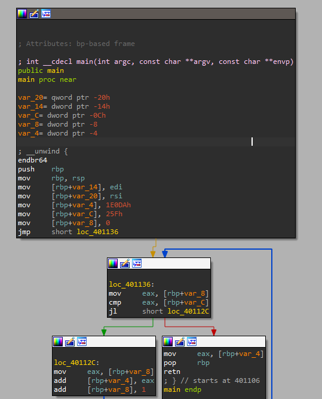

# GDB_baby_step_1

### Given:
1. `debugger0_b` file

### Solution
1. Open the file in IDA. You can see the assembly code in the screenshot below:


2. The pseudocode shows a loop adding values to v5, starting at 123098. The return value is stored in the eax register, which is standard for functions returning 32-bit integers.

```c
int __cdecl main(int argc, const char **argv, const char **envp)
{
  int i; // [rsp+18h] [rbp-8h]
  int v5; // [rsp+1Ch] [rbp-4h]

  v5 = 123098;
  for ( i = 0; i < 607; ++i )
    v5 += i;
  return v5;
}
```
3. Calculating the result:
```
v5 = 123098 + (0 + 1 + ... + 606) = 307019
```
4. The final value, 307019, is stored in eax and returned by the function